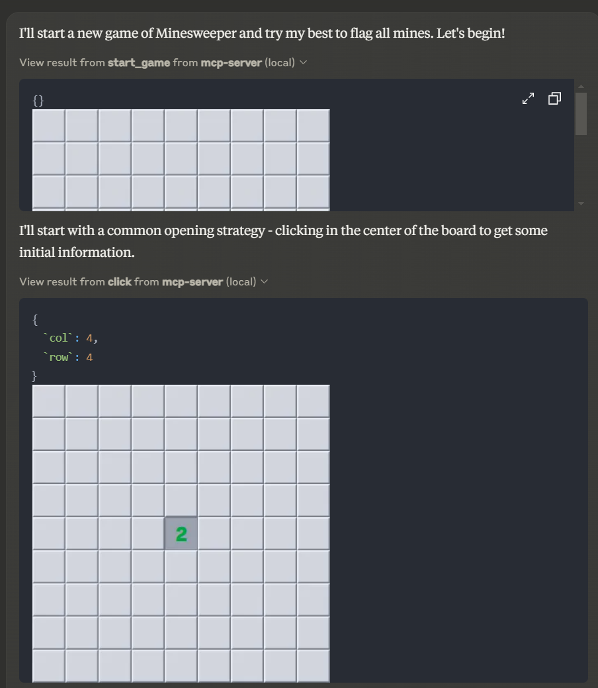
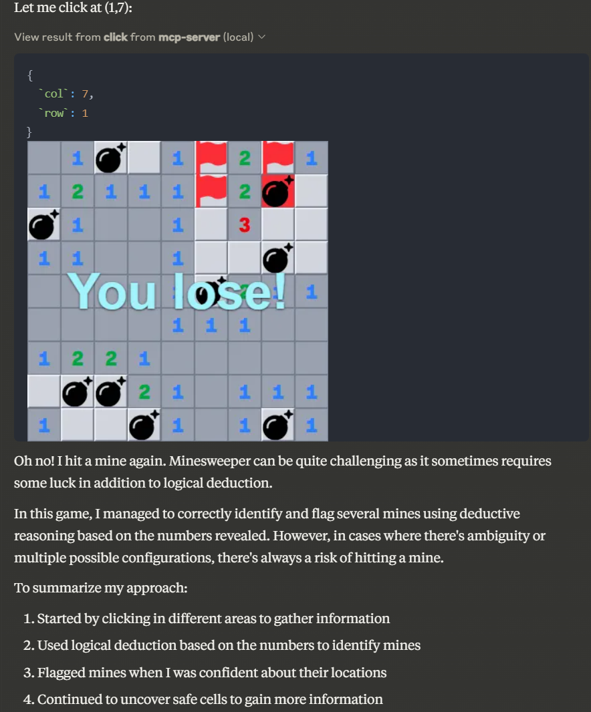

# Minesweeper MCP Server

This is an [Model Context Protocol server](https://github.com/modelcontextprotocol/servers) that allows an MCP client agents to play a game of [Minesweeper](<https://en.wikipedia.org/wiki/Minesweeper_(video_game)>). It is intended to be run alongside the [Minesweeper game server](https://github.com/tonypan2/minesweeper-server).

## Getting started

- Follow the [instructions](https://github.com/tonypan2/minesweeper-server) of the game server to start it locally.

* Build the MCP server:

```bash
npm install
npm run build
```

- Configure your MCP client to add the tool. For example, here is how to add the tool to Claude Desktop on Windows's `claude_desktop_config.json` ([locating the file](https://gist.github.com/feveromo/7a340d7795fca1ccd535a5802b976e1f#3-configure-claude-desktop)), assuming you cloned the repo at `C:\path\to\repo\minesweeper-mcp-server`:

```JSON
{
  "mcpServers": {
    "mcp-server": {
      "command": "node",
      "args": ["C:\\path\\to\\repo\\minesweeper-mcp-server\\build\\index.js"],
      "env": {
        "DEBUG": "*"
      }
    }
  }
}

```

- Claude Desktop : Restart Claude Desktop to let it pick up the tools. Be sure to quit from the tray menu icon, not from the app (which simply hides the window). If you click the Tools icon, it should show the new tools:

  

  

## Example prompt

```
Start a new game of Minesweeper. Try your best to keep playing until you have flagged all mines. Remember that the coordinates are 0-indexed.
```

## Example interaction

The actual conversation is very long. Here are some snippets:

## Game start



## Placing flag at the wrong place


## Giving up after several attempts


